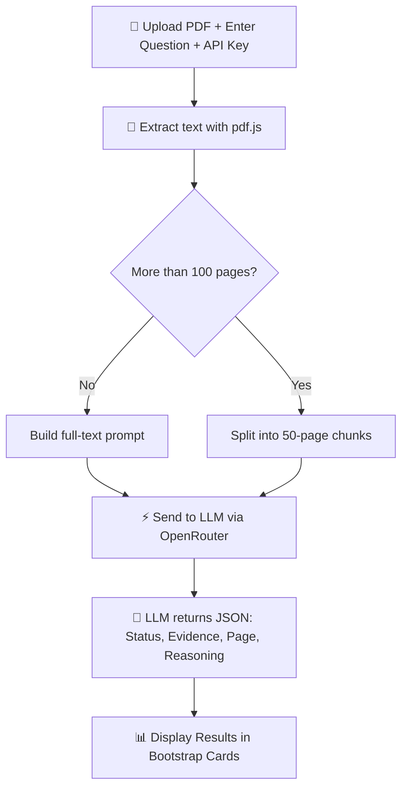

# 📑 Document Compliance Analyzer

> **This is a demo. It contains no confidential data/IP.**

A browser-based tool that uses **pdf.js** and **LLM APIs (via OpenRouter)** to analyze large PDF documents for compliance questions.  
Upload a PDF, enter a compliance query, and get structured results with **evidence, page number, and reasoning** – all powered by AI.

---

## 🚀 Features

- **PDF Upload & Extraction** – Reads and extracts text from PDFs using [pdf.js](https://mozilla.github.io/pdf.js/).
- **LLM Analysis** – Sends document content to an LLM via [OpenRouter](https://openrouter.ai/) for compliance Q&A.
- **Smart Chunking** – Automatically splits PDFs into chunks if >100 pages, ensuring scalable analysis.
- **Interactive Progress Overlay** – Real-time progress updates during PDF parsing and AI analysis.
- **Results Dashboard** – Displays findings with:
  - Compliance status badges (`Yes`, `No`, `Not Reported`)
  - Quoted evidence from the document
  - Page numbers
  - AI reasoning
- **Error Handling** – Graceful alerts for invalid inputs or API errors.
- **Bootstrap 5 UI** – Clean, responsive interface with live alerts and cards.

---

## ⚡ How It Works



## 📄 Workflow

1. **User Input**
   - Uploads a PDF document  
   - Enters a **Compliance Question**  
   - Provides **OpenRouter API Key**  
   - Selects the **LLM Model**  

2. **PDF Processing**
   - Text is extracted **page by page** using `pdf.js`.  

3. **Chunking Logic**
   - If the document is **large**, it is split into manageable **chunks**.  
   - Otherwise, it is processed in a **single request**.  

4. **LLM Analysis**
   - The extracted text + question is sent to the **LLM** for compliance analysis.  

5. **Results Display**
   - LLM response is parsed into **structured JSON**.  
   - Results are shown with **status, evidence, and reasoning**.  

---

## 🛠️ Setup & Usage

### 1. Clone the repository
```bash
git clone https://github.com/Nitin399-maker/pdfext.git
cd pdfext

